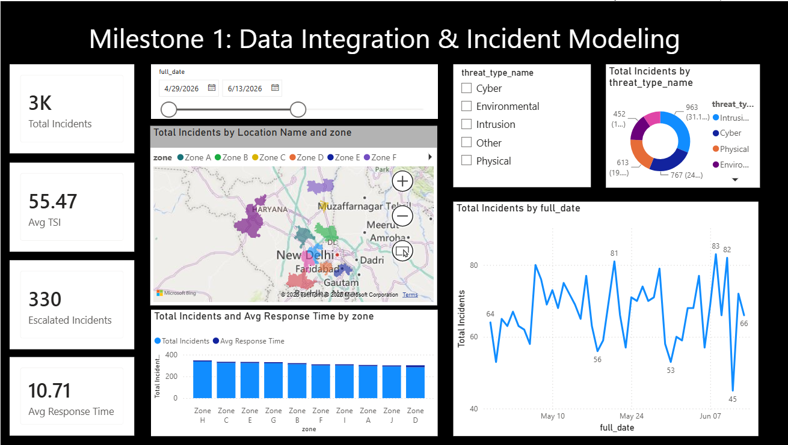
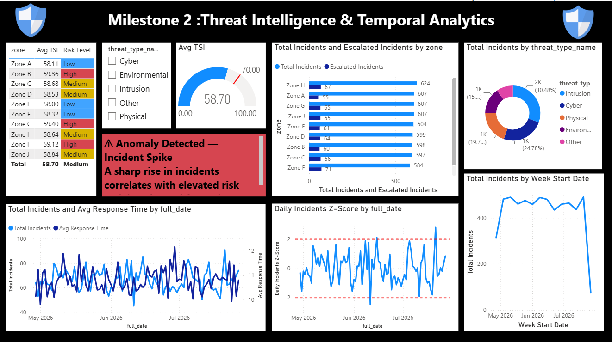
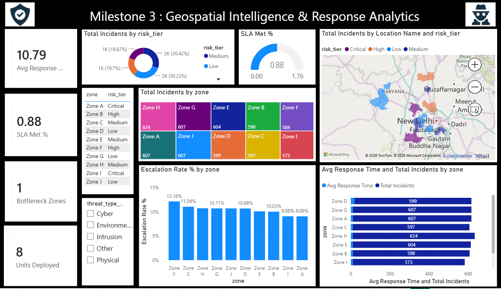
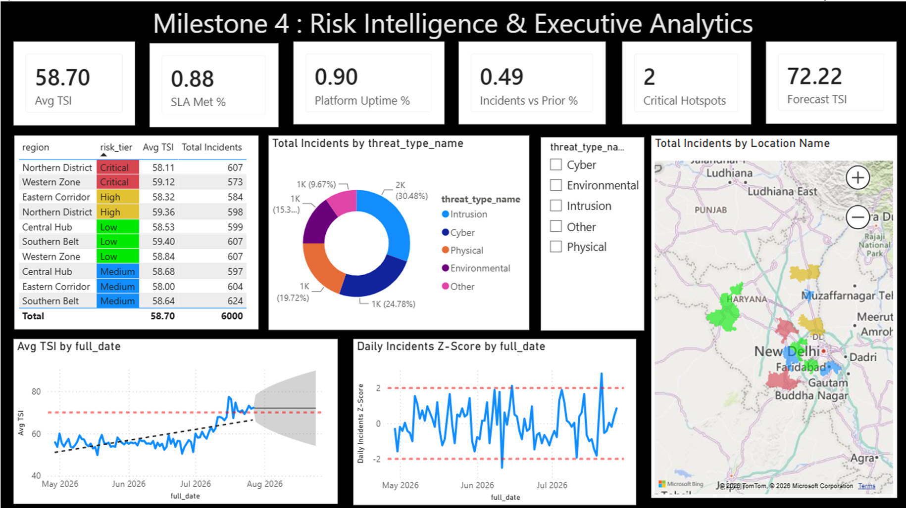

# 🛡️ Enterprise Threat Intelligence & Geospatial Risk Analytics

[](https://powerbi.microsoft.com/)
[](https://learn.microsoft.com/en-us/dax/)
[](#-data-architecture--modeling)
[](#)

An enterprise-grade Security Operations Center (SOC) Business Intelligence solution built on **Microsoft Power BI**. This project transforms raw security telemetry, external feeds, and spatial coordinates into actionable risk intelligence through automated anomaly detection, statistical forecasting, and response tracking across regional zones.

---

## 📌 Project Overview

Organizations face constant security threats across various geographic locations and operational units. This project collects raw threat feeds, cleanses and standardizes telemetry logs, establishes dimensional data modeling (Star Schema), and produces interactive executive dashboards for proactive incident monitoring and data-driven incident containment.

---

## 📑 Table of Contents
1. [Project Overview](#-project-overview)
2. [Data Architecture & Modeling](#-data-architecture--modeling)
3. [Key Performance Indicators (KPIs)](#-key-performance-indicators-kpis)
4. [Milestone Dashboards & Previews](#-milestone-dashboards--previews)
   - [Milestone 1: Data Integration & Incident Modeling](#milestone-1-data-integration--incident-modeling)
   - [Milestone 2: Threat Intelligence & Temporal Analytics](#milestone-2-threat-intelligence--temporal-analytics)
   - [Milestone 3: Geospatial Intelligence & Response Analytics](#milestone-3-geospatial-intelligence--response-analytics)
   - [Milestone 4: Risk Intelligence & Executive Analytics](#milestone-4-risk-intelligence--executive-analytics)
5. [Key Analytical Insights](#-key-analytical-insights)
6. [Tech Stack & Skills](#-tech-stack--skills)
7. [Repository Structure](#-repository-structure)
8. [How to View This Project](#-how-to-view-this-project)
9. [About the Author & Contact](#-about-the-author)

---

## 🏗️ Data Architecture & Modeling

The project transitions from unstructured raw logs into an optimized **Star Schema Data Warehouse Model**:

### 1. Raw Feeds Layer (`ThreatAnalytics_RawSourceData/`)
* **`incident_logs.csv`**: Core security incident tracking and timeline records.
* **`external_threat_feed.csv`**: External threat signals, attack signatures, and severity indicators.
* **`operational_data.csv`**: Infrastructure impact metrics and system performance records.
* **`geo_metadata.csv`**: Region codes, server locations, and facility coordinates.
* **`environmental_feeds.csv`**: Surrounding physical and contextual system health telemetry.

### 2. Dimensional Data Model (`Clean datset for 1 milestone/`)
* **Fact Table**:
  * `Fact_Incident`: Central transactional table capturing incident volume, impact duration, response time, and alert levels.
* **Dimension Tables**:
  * `Dim_Geo`: Normalized spatial attributes (Region, Latitude, Longitude, Facility/Zone ID).
  * `Dim_ThreatType`: Categories of attacks (`Intrusion`, `Cyber`, `Physical`, `Environmental`, `Other`).
  * `Dim_Time`: Standard calendar dimension (Date, Day, Month, Quarter, Year).
  * `Dim_Operational`: Impacted business units and operational health flags.
  * `Dim_Source`: Ingestion origin points and sensor device metadata.

---

## 📈 Key Performance Indicators (KPIs)

* **Avg TSI (Threat Severity Index)**: Weighted metric evaluating multi-vector attack severity (Baseline: ~58.70).
* **SLA Met %**: Proportion of incidents resolved within targeted security response times (88% compliance).
* **Escalation Rate %**: Percentage of initial flags escalating to tier-2 incident intervention.
* **Z-Score Anomaly Trigger**: Real-time statistical flag triggering alert when daily incident counts exceed $\pm 2\sigma$ standard deviations from the moving mean.
* **Platform Uptime %**: Core infrastructure operational availability (maintained at 90%+).

---

## 🖥️ Milestone Dashboards & Previews

### Milestone 1: Data Integration & Incident Modeling
> Focuses on dimensional hygiene, primary incident ingestion, threat type breakdown, and regional baseline metrics.



* **Key Metrics**: 3K Total Incidents, 55.47 Avg TSI, 330 Escalated Incidents, 10.71 Avg Response Time.
* **Core Visuals**: Regional incident distribution across Delhi-NCR & Haryana, threat category donut chart (`Intrusion` 31.1%, `Cyber` 24.7%), and daily volume trends.

---

### Milestone 2: Threat Intelligence & Temporal Analytics
> Incorporates statistical time-series monitoring, Z-Score incident surge alarms, and zone-level risk categorization.



* **Key Metrics**: Dynamic TSI Gauge (58.70), Zone risk matrices (High/Medium/Low indicators).
* **Statistical Anomaly Detection**: Daily incident Z-Score line chart plotted against critical bounds ($\pm 2\sigma$), flagging sudden surges in attack frequency.
* **Automated Alert Banner**: Dynamic visual alert for incident volume spikes correlating with elevated threat risk.

---

### Milestone 3: Geospatial Intelligence & Response Analytics
> Spatial correlation between incident density, unit allocation, bottleneck zones, and SLA operational adherence.



* **Key Metrics**: 0.88 SLA Met %, 1 Identified Bottleneck Zone, 8 Response Units Deployed.
* **Core Visuals**: Incident density categorized by Risk Tier (`Critical`, `High`, `Medium`, `Low`), interactive spatial bubble mapping, and Zone Escalation Rate rankings.

---

### Milestone 4: Risk Intelligence & Executive Analytics
> Final command view for security leadership combining predictive trend forecasting, platform reliability, and critical hotspot tracking.



* **Key Metrics**: 58.70 Avg TSI, 0.88 SLA Met %, 0.90 Platform Uptime, 2 Critical Hotspots, 72.22 Forecast TSI.
* **Advanced Analytics**: Machine learning-driven TSI forecasting with confidence bands evaluating expected security posture shifts into the upcoming month.

---

## 💡 Key Analytical Insights

1. **Dominant Attack Vectors**: Intrusion and Cyber attacks represent over 55% of all recorded security events.
2. **Geographical Concentration**: Northern District and Western Zones consistently operate in `Critical` risk tiers, requiring priority patrol and infrastructure bandwidth allocation.
3. **Operational Bottleneck Mitigation**: Identified specific zones exhibiting high escalation rates (>12%) despite acceptable response times, prompting targeted SOP restructuring.
4. **Predictive Preparedness**: TSI forecasting models project a risk elevation from 58.70 to 72.22, providing security leaders foresight for proactive defensive resource deployment.

---

## 🛠️ Tech Stack & Skills

* **Business Intelligence & Visualization**: Power BI Desktop (`report.pbix`), DAX (Calculated Columns, Measures, Time Intelligence, Dynamic Alerting).
* **Data Engineering & ETL**: Power Query, Schema Normalization, Missing Value Imputation, Star Schema Data Modeling.
* **Analytical Techniques**: Geospatial Mapping, Statistical Z-Score Anomaly Detection, Time-Series Forecasting.
* **Business Reporting**: Executive Presentations & Milestone Decks (`.pptx`).

---

## 📂 Repository Structure

```text
├── data/
│   ├── raw/                  # ThreatAnalytics_RawSourceData CSV files
│   └── processed/            # Clean dataset (Dim and Fact CSV tables)
├── docs/                     # Dashboard screenshots for repository preview
│   ├── milestone1.png
│   ├── milestone2.png
│   ├── milestone3.png
│   └── milestone4.png
├── presentations/            # Milestone slide decks & final submission PPTX files
├── report.pbix               # Full interactive Power BI report
└── README.md                 # Primary project documentation


## 👨‍💻 About the Author

Hi, I'm **Neeraj Sharma**! 👋  

I am an **MSc Data Science student** and an **AI & ML Enthusiast**, passionate about solving real-world problems using **Machine Learning** and **Deep Learning**. I enjoy exploring data, building predictive models, and experimenting with modern AI workflows.

- 🎓 **Education:** Pursuing MSc in Data Science
- 💡 **Interests:** Machine Learning, Deep Learning, Data Analytics & Artificial Intelligence
- 🔭 **Current Focus:** Building hands-on ML/DL projects and practical AI solutions
- 🤝 **Open for:** Collaborations on AI/ML projects and research ideas

---
📬 *Feel free to connect, star the repo ⭐, or reach out if you have feedback or suggestions!*

---

## 📬 Connect With Me

- GitHub: [https://github.com/Neerajsharma18dev](https://github.com/Neerajsharma18dev)
- LinkedIn: [https://www.linkedin.com/in/neeraj-sharma-240b13404/](https://www.linkedin.com/in/neeraj-sharma-240b13404/)
- Email: neerajsharma99840@gmail.com

---